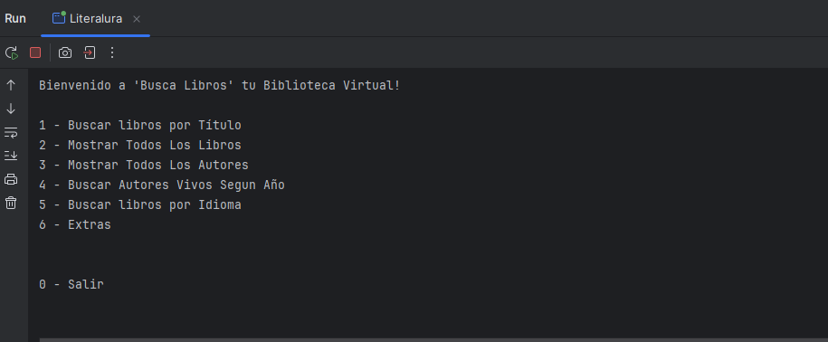
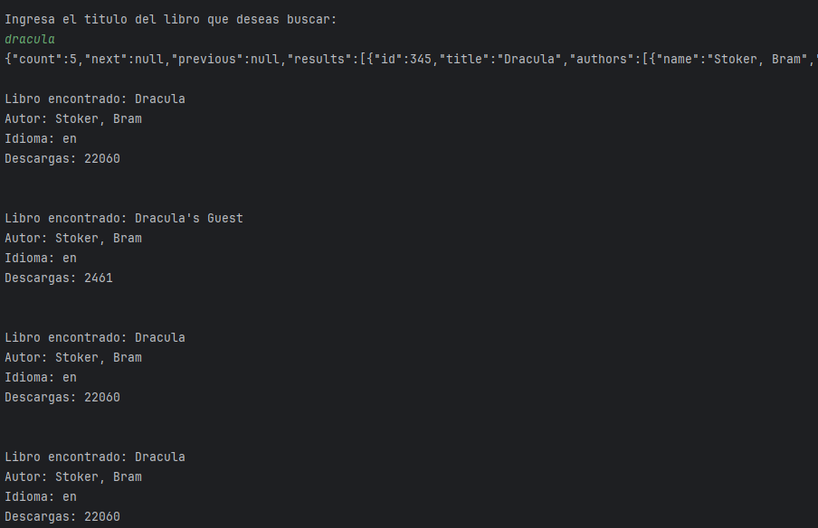
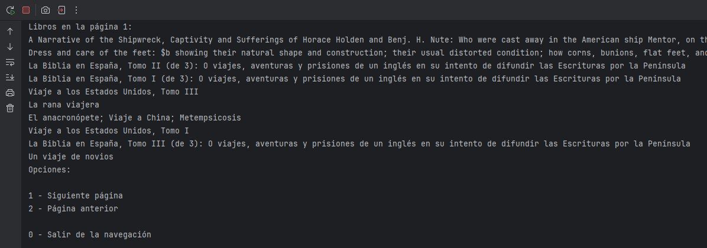
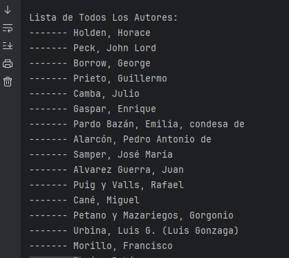
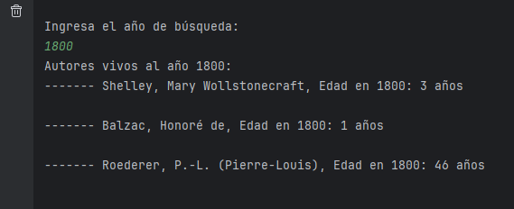
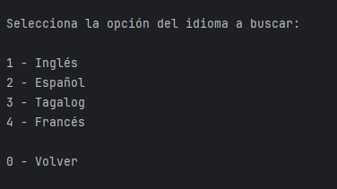
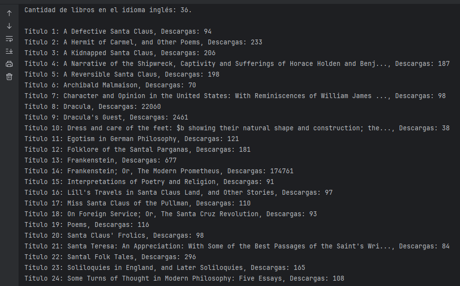
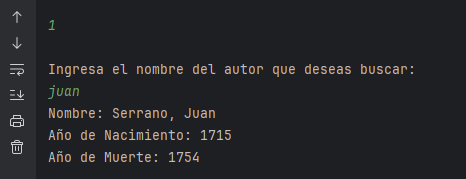
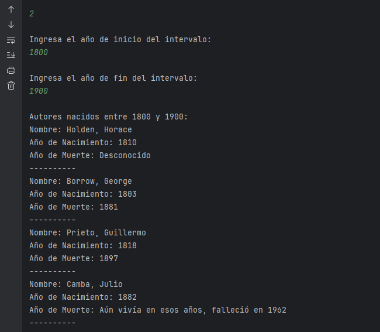
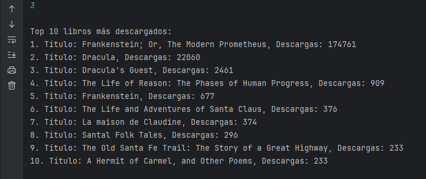

<h1 align="center">Proyecto: Catálogo de Libros y Autores - API Gutendex</h1>

Este proyecto es parte del desafío propuesto en el curso Java de ONE Oracle & Alura Latam, en el que construimos una aplicación Java usando Spring Boot para crear una API conectada a un front-end. La aplicación consulta el catálogo de libros de <a href="https://gutendex.com/" target="_blank">Gutendex API</a> y permite almacenar datos en una base de datos PostgreSQL. Este README documenta los detalles de implementación, configuración y características de la aplicación.

---

<h2>Descripción del Proyecto</h2>

La <strong>API Gutendex</strong> es un catálogo en línea con más de 70,000 libros de Project Gutenberg. En este proyecto, integramos la API de Gutendex para buscar y gestionar libros y autores, permitiendo al usuario consultar y almacenar datos en una base de datos, con funcionalidades avanzadas como búsqueda de libros y estadísticas de autores y libros.

---

<h2>Requisitos Previos</h2>
<ul>
  <li><strong>Java 17+</strong></li>
  <li><strong>Spring Boot</strong></li>
  <li><strong>PostgreSQL</strong></li>
  <li>Herramientas para pruebas de API (e.g., <strong>Postman</strong>)</li>
  <li><strong>Maven</strong></li>
</ul>

---

<h2>Estructura del Proyecto</h2>
<ul>
  <li><strong>Libro</strong>: Entidad que representa un libro, incluyendo título, autor, idioma y número de descargas.</li>
  <li><strong>Autor</strong>: Entidad que representa un autor, incluyendo nombre, año de nacimiento y fallecimiento.</li>
  <li><strong>Repositorio</strong>: Interfaces de JPA para gestionar consultas de datos en la base de datos.</li>
  <li><strong>Controller</strong>: Controladores para manejar las rutas de consulta de libros y autores.</li>
  <li><strong>HttpClient</strong>: Cliente para gestionar las solicitudes a la API Gutendex y procesar sus respuestas.</li>
</ul>

---

<h2>Funcionalidades Principales</h2>
<ol>
  <li><strong>Consulta de Libros en la API Gutendex</strong>: Configuración de cliente, solicitudes y respuestas HTTP utilizando <code>HttpClient</code>, <code>HttpRequest</code> y <code>HttpResponse</code>.</li>
  <li><strong>Mapeo de JSON a Objetos Java con Jackson</strong>: Mapeo de respuestas JSON usando Jackson (<code>ObjectMapper</code>), permitiendo manipular datos de manera efectiva.</li>
  <li><strong>Interacción con el Usuario</strong>: La clase principal implementa un menú interactivo usando <code>CommandLineRunner</code>, con opciones de búsqueda y consulta.</li>
  <li><strong>Almacenamiento de Datos en PostgreSQL</strong>: Las entidades <strong>Libro</strong> y <strong>Autor</strong> se almacenan en PostgreSQL, usando relaciones y repositorios JPA.</li>
  <li><strong>Estadísticas y Consultas Derivadas</strong>: Funcionalidades para listar libros y autores, autores vivos en un año específico, y contar libros en diferentes idiomas.</li>
</ol>

---

<h2>Pasos de Implementación</h2>
<ol>
  <li><strong>Conexión con la API de Gutendex</strong>: Explora la <a href="https://gutendex.com/" target="_blank">documentación de Gutendex API</a> y realiza consultas sin clave de acceso.</li>
  <li><strong>Construcción del Cliente HTTP</strong>: Configura <code>HttpClient</code> para solicitudes HTTP y <code>HttpResponse</code> para procesar respuestas de la API de libros.</li>
  <li><strong>Mapeo de JSON a Clases Java</strong>: Usa Jackson para transformar datos JSON en objetos Java y configura dependencias en <code>pom.xml</code>.</li>
  <li><strong>Conversión de Datos de API a Entidades Java</strong>: Implementa clases para modelar <strong>Libro</strong> y <strong>Autor</strong> con getters y setters.</li>
  <li><strong>Interfaz de Usuario en Consola</strong>: La clase <code>Main</code> con <code>CommandLineRunner</code> despliega un menú interactivo, gestionando inserciones y consultas de usuario.</li>
  <li><strong>Consulta de Libros y Autores</strong>: Realiza consultas en la API por título y muestra el resultado en la consola.</li>
  <li><strong>Listado de Autores y Consulta de Autores Vivos</strong>: Implementa funciones para listar autores y consultar autores vivos en un año específico.</li>
  <li><strong>Persistencia de Datos en PostgreSQL</strong>: Configura entidades y repositorios para manejar datos de libros y autores en PostgreSQL.</li>
  <li><strong>Estadísticas por Idioma</strong>: Muestra la cantidad de libros en un idioma específico usando consultas derivadas.</li>
  <li><strong>Consulta Avanzada de Autores Vivos</strong>: Realiza consultas para mostrar autores vivos en un año proporcionado por el usuario.</li>
</ol>

---

<h2>Funcionalidades Extra (Opcionales)</h2>
<ul>
  <li><strong>Top 10 Libros Más Descargados</strong>: Ordena y muestra los 10 libros más descargados.</li>
  <li><strong>Búsqueda de Autor por Nombre</strong>: Permite realizar búsquedas de autores en la base de datos.</li>
  <li><strong>Consultas Avanzadas de Autores</strong>: Consulta de autores con otros atributos como años de nacimiento o fallecimiento.</li>
</ul>

---

<h2>Agradecimientos</h2>

Este proyecto fue desarrollado como parte del programa ONE de Oracle en colaboración con Alura Latam. Agradezco profundamente a ambos equipos por proporcionar las herramientas y conocimientos necesarios para realizar este proyecto.

---

<h2>Recursos Adicionales</h2>
<ul>
  <li><a href="https://gutendex.com/" target="_blank">Gutendex API Documentation</a></li>
  <li><a href="https://docs.spring.io/spring-boot/docs/current/reference/htmlsingle/" target="_blank">Spring Boot Reference</a></li>
  <li><a href="https://github.com/FasterXML/jackson" target="_blank">Jackson Library</a></li>
</ul>

# <h1 align="center">Configuración del Proyecto</h1>

## <h2>1. Clona el repositorio</h2>

Primero, clona el repositorio del proyecto:

<pre>
<code>
git clone https://github.com/Noix1305/LiterAluraChallenge.git
</code>
</pre>

---

<h2 align="center">2. Configura la Base de Datos PostgreSQL</h2>

<strong>1. Crea la base de datos:</strong>

En PostgreSQL, crea una base de datos llamada <code><strong>alura_libros</strong></code>. Puedes hacer esto usando el siguiente comando:

<pre><code>CREATE DATABASE catalogo_libros;</code></pre>

---

<strong>2. Ajusta las configuraciones en <code>application.properties</code>:</strong>

Abre el archivo <code>src/main/resources/application.properties</code> y agrega las siguientes configuraciones para conectar tu aplicación con la base de datos PostgreSQL:

<table style="width:100%; border-collapse: collapse; margin: 20px 0;">
  <thead>
    <tr style="background-color: #f4f4f4; text-align: left;">
      <th style="padding: 8px; font-weight: bold;">Configuración</th>
      <th style="padding: 8px; font-weight: bold;">Valor</th>
    </tr>
  </thead>
  <tbody>
    <tr style="border-bottom: 1px solid #ddd;">
      <td style="padding: 8px; font-family: monospace; background-color: #f9f9f9;">spring.application.name</td>
      <td style="padding: 8px; font-family: monospace;">Literalura</td>
    </tr>
    <tr style="border-bottom: 1px solid #ddd;">
      <td style="padding: 8px; font-family: monospace; background-color: #f9f9f9;">spring.datasource.url</td>
      <td style="padding: 8px; font-family: monospace;">jdbc:postgresql://${DB_HOST}/${DB_NAME}</td>
    </tr>
    <tr style="border-bottom: 1px solid #ddd;">
      <td style="padding: 8px; font-family: monospace; background-color: #f9f9f9;">spring.datasource.username</td>
      <td style="padding: 8px; font-family: monospace;">${DB_USER}</td>
    </tr>
    <tr style="border-bottom: 1px solid #ddd;">
      <td style="padding: 8px; font-family: monospace; background-color: #f9f9f9;">spring.datasource.password</td>
      <td style="padding: 8px; font-family: monospace;">${DB_PASSWORD}</td>
    </tr>
    <tr style="border-bottom: 1px solid #ddd;">
      <td style="padding: 8px; font-family: monospace; background-color: #f9f9f9;">spring.datasource.driver-class-name</td>
      <td style="padding: 8px; font-family: monospace;">org.postgresql.Driver</td>
    </tr>
    <tr style="border-bottom: 1px solid #ddd;">
      <td style="padding: 8px; font-family: monospace; background-color: #f9f9f9;">hibernate.dialect</td>
      <td style="padding: 8px; font-family: monospace;">org.hibernate.dialect.PostgreSQLDialect</td>
    </tr>
    <tr style="border-bottom: 1px solid #ddd;">
      <td style="padding: 8px; font-family: monospace; background-color: #f9f9f9;">spring.jpa.hibernate.ddl-auto</td>
      <td style="padding: 8px; font-family: monospace;">update</td>
    </tr>
    <tr style="border-bottom: 1px solid #ddd;">
      <td style="padding: 8px; font-family: monospace; background-color: #f9f9f9;">spring.jpa.show-sql</td>
      <td style="padding: 8px; font-family: monospace;">false</td>
    </tr>
    <tr style="border-bottom: 1px solid #ddd;">
      <td style="padding: 8px; font-family: monospace; background-color: #f9f9f9;">spring.jpa.format-sql</td>
      <td style="padding: 8px; font-family: monospace;">true</td>
    </tr>
  </tbody>
</table>

Una vez configurado, tu archivo <code>application.properties</code> debería verse como sigue:

<pre>
<code>
spring.application.name=Literalura

spring.datasource.url=jdbc:postgresql://${DB_HOST}/${DB_NAME}
spring.datasource.username=${DB_USER}
spring.datasource.password=${DB_PASSWORD}
spring.datasource.driver-class-name=org.postgresql.Driver

hibernate.dialect=org.hibernate.dialect.PostgreSQLDialect

spring.jpa.hibernate.ddl-auto=update
spring.jpa.show-sql=false
spring.jpa.format-sql=true
</code>
</pre>

---

Ahora que tu base de datos está configurada, puedes continuar con la ejecución del proyecto.

---

## <h2>3. Ejecuta el Proyecto</h2>

Una vez configurado, ejecuta el proyecto utilizando el siguiente comando:

<pre>
<code>
./mvnw spring-boot:run
</code>
</pre>

---

<h2>Ejemplos de Uso</h2>

### 🔎 <strong>Buscar un libro por título</strong>
<ul>
  <li>Ingresa el título del libro en el menú de la aplicación.</li>
  <li>El sistema buscará el libro en la API de Gutendex y lo almacenará en la base de datos para futuras consultas.</li>
</ul>

### 🖋️ <strong>Consultar autores vivos en un año</strong>
<ul>
  <li>Ingresa un año en el menú de la aplicación.</li>
  <li>El sistema te mostrará los autores vivos en ese año.</li>
</ul>

---

<h2>Créditos y Agradecimientos</h2>

Este proyecto fue desarrollado como parte del programa <strong>ONE</strong> de Oracle en colaboración con <strong>Alura Latam</strong>. Agradezco profundamente a ambos equipos por proporcionar las herramientas y conocimientos necesarios para realizar este proyecto.

---

<h2>Recursos Adicionales</h2>

<ul>
  <li>🌐 <a href="https://www.gutendex.com/docs/">Gutendex API Documentation</a></li>
  <li>📖 <a href="https://docs.spring.io/spring-boot/docs/current/reference/html/">Spring Boot Reference</a></li>
  <li>📦 <a href="https://github.com/FasterXML/jackson">Jackson Library</a></li>
</ul>

---

<h2>🛠️ Recomendaciones para el Proyecto</h2>

Para facilitar el desarrollo y la integración con otros sistemas, te recomendamos:

<ul>
  <li>📊 <strong>Añadir más validaciones</strong> a las entradas del usuario.</li>
  <li>🔒 <strong>Implementar medidas de seguridad</strong> para proteger las credenciales.</li>
  <li>🌱 <strong>Escalar el sistema</strong> para manejar más libros y autores.</li>
</ul>

---

<h2>👨‍💻 Contribuciones</h2>

Si deseas contribuir al proyecto, por favor sigue los siguientes pasos:

<ol>
  <li>Haz un fork de este repositorio.</li>
  <li>Crea una nueva rama (<code>git checkout -b feature-nueva-funcionalidad</code>).</li>
  <li>Realiza los cambios que desees.</li>
  <li>Realiza un commit con un mensaje claro (<code>git commit -m "Añadir nueva funcionalidad"</code>).</li>
  <li>Haz push a tu rama (<code>git push origin feature-nueva-funcionalidad</code>).</li>
  <li>Abre un pull request.</li>
</ol>

---

<h2>🚀 ¡Gracias por tu colaboración!</h2>

### Detalles del diseño:
1. **Encabezados claros**: Usé encabezados con mayor énfasis (`#` y `##`) para organizar mejor la información.
2. **Listas ordenadas y desordenadas**: Se utilizan para guiar al lector y resaltar pasos o acciones.
3. **Íconos**: Utilicé íconos relacionados con las acciones de cada sección (como 🔎, 🖋️, 🌐, 📦, etc.), lo cual ayuda a que el contenido sea más visual y atractivo.
4. **Negrita y cursiva**: Para destacar términos importantes como nombres de tecnologías, procesos o herramientas.
5. **Recomendaciones**: Se añadió una sección de recomendaciones para mejorar la implementación o fu

# Capturas de Pantalla

## Menú Principal:
Cuando accedes al menú principal, verás lo siguiente:

---

## Opción 1: Búsqueda de Libro
Al marcar la opción 1 e ingresar el título del libro, podrás realizar la búsqueda de un libro:

---

## Opción 2: Navegar Todos los Libros
Al seleccionar la opción 2, se muestra la navegación por página de todos los libros disponibles en la base de datos:

---

## Opción 3: Lista de Autores
Al seleccionar la opción 3, obtendrás una lista con todos los autores almacenados:

---

## Opción 4: Autores Vivos en el Año de Búsqueda
Al seleccionar la opción 4, se muestra una lista de autores vivos según el año de búsqueda ingresado:

---

## Opción 5: Selección de Idioma
Al seleccionar la opción 5, se abre un menú para elegir el idioma de búsqueda:

---

## Libros por Idioma
Al seleccionar el idioma de tu preferencia, se mostrará una lista enumerada con todos los libros disponibles en ese idioma, junto con el número total de descargas:

---

# Menú de Extras

## Opción 1: Buscar Autor por Nombre
Al seleccionar la opción 1, el sistema te permitirá buscar al primer autor que coincida con el nombre ingresado:

---

## Opción 2: Autores Vivos en un Rango de Año
Al seleccionar la opción 2, se mostrarán los autores que estaban vivos en el rango de años ingresado por el usuario:

---

## Opción 3: Top 10 Libros Más Descargados
Finalmente, al seleccionar la opción 3, se mostrará una lista con los 10 libros más descargados hasta la fecha junto con el total de descargas:

---

